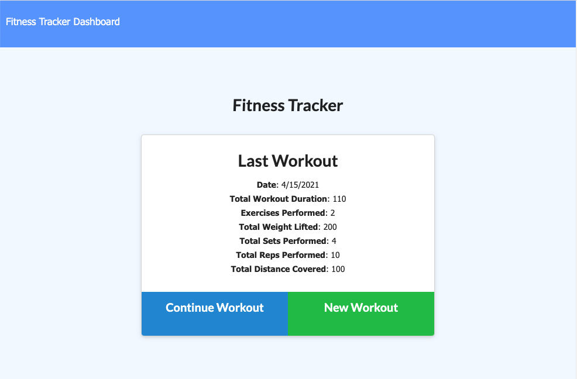
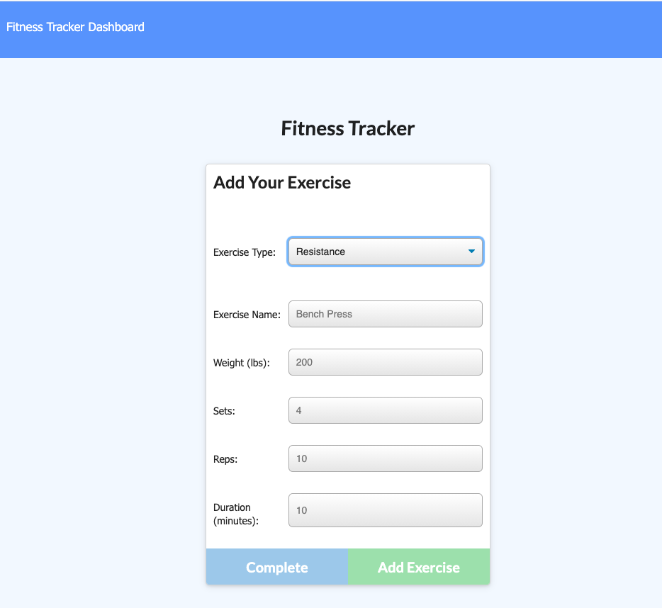
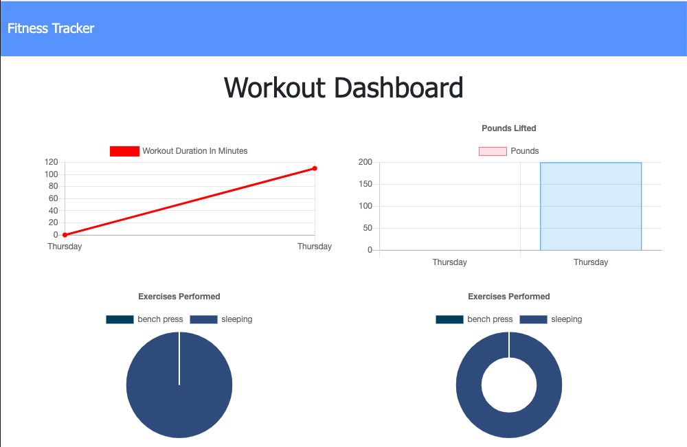

   

# 
 **Fitness Tracker** 

--- 

--- 

## **Table Of Contents** 

---

1. [Description](#description)
2. [Installation](#installation)
3. [Usage](#usage)
4. [Contributing](#contributing)
5. [Review and Contribute](#github)

--- 

## 
  **Description** 
 

--- 

This app is used to view, create, and track daily workouts.  It logs multiple exercises in a workout on a given day.  It tracks the name, type, weight, sets, reps, and duration of exercise.  If the exercise is a cardio exercise, it tracks the distance traveled as well.

--- 
 
## 
  **Installation** 

--- 
 <ol>
   <li>This app is deployed to Heroku and git hub.  If you wish to download it locally clone the repo and install dependencies with the command npm install.</li>
   <li>Once the dependencies are downloaded enter the command npm start.  This will launch the app on PORT 3000 and should be functioning at localhost:3000.</li>
</ol>

--- 

## 
  **Usage** 

--- 

At the root of the app you are greeted with any stats from the previous workout as well as buttons that allow you to continue that workout or create a new one.  From those buttons you will be directed to a collection of selections in a drop down menu.

The user is then presented with stats input fields in order to track the exercise.  Once input has been completed, and the button is clicked, you will be brought back to the root with the stats collected from that workout presented.

If you would like to check out the stats of a certain workout on the days from the previous week, click on the Dashboard option in the top left corner.  From here you will see a couple charts that have collected data from the week and plots them in order to track your exercise throughout the week.

--- 

## 
  **Contributing** 

--- 

Open for contributions, licence is attached.

--- 

## 
 **Review and contribute here**

### _Github:_ [cmgson/fitness-tracker](https://github.com/cmgson/fitness-tracker)

### _Heroku:_ [Fitness-tracker](https://salty-forest-35089.herokuapp.com/)

### _Email:_ cmgson1@gmail.com

--- 
